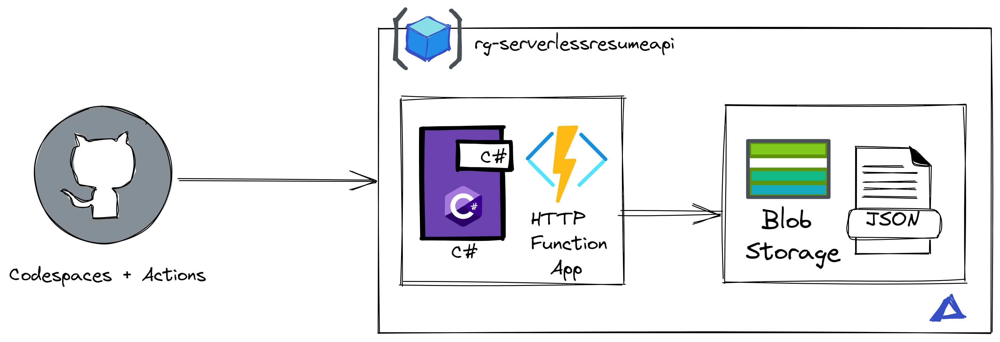

# Your Resume API on Azure Serverless

Create an [API](https://learn.microsoft.com/training/modules/build-api-azure-functions/3-overview-api) with Azure Function that displays your resume information in json. 

## Architecture 



- GitHub for Version control.
- [GitHub Actions](https://docs.github.com/en/actions) for CI/CD pipeline.
- [Azure Functions](https://learn.microsoft.com/en-us/azure/azure-functions/functions-overview) to deploy our API.
- Azure Blob Storage to store our resume.
- .NET 6 as our programming framework for our API.
- Optional: [GitHub Codespaces](https://docs.github.com/en/codespaces/overview) as our development environment. 
- [Bicep](https://learn.microsoft.com/en-us/azure/azure-resource-manager/bicep/overview?tabs=bicep) for our Infrastructure as Code.

## You'll need

- Azure account
- GitHub account
- I've provided a sample .json file based on the [Json resume](https://jsonresume.org/schema/)

For local developer environment

- VS Code
- Docker
- [VS Code Dev Container Extension](https://code.visualstudio.com/docs/devcontainers/tutorials)

> **NOTE**
> At the moment, GitHub Free for personal accounts comes with 15 GB of Codespaces storage and 120 Core hours per month. Read more about [pricing here](https://docs.github.com/billing/managing-billing-for-github-codespaces/about-billing-for-github-codespaces)

## How to get started

### Get the code and environment

1. [Fork the repository](https://docs.github.com/pull-requests/collaborating-with-pull-requests/working-with-forks/about-forks) so you can have your own copy of it. 
2. FOR CLOUDSPACES: Click on the `Code` button, click on `Codespaces` tab, and click on `Create Codespaces on main`. I've provided a [`devcontainer.json`](https://code.visualstudio.com/docs/devcontainers/create-dev-container) file with the configuration needed for this project.
3. Once your Codespace has loaded, in the Explorer, expand the `src` folder and rename `local.settings.sample.json` to `local.settings.json`
4. FOR LOCAL DEV: Clone the code, open it with VS Code and Launch in the dev container. More info [here](https://code.visualstudio.com/docs/devcontainers/containers)

### Authenticate your Environment with Azure
1. In the Terminal, type `az login --use-device-code` to log into your Azure account from the az cli in your Codespace.
2. In the Terminal, type `az account list --output table` to get a list of Azure subscriptions you have available to you and make note of the name you want to use. 
3. In the Terminal, type `az account set --name "name-of-subscription"` with the name of the subscription you want to use.
4. In the Terminal, type `az account show` and make sure it's set to the subscription you want to work in.

### Provision resources in Azure

> **NOTE:** I've set the resource group name to be `rg-serverlessresumeapi`

1. I've provided Infrastructure as Code (IaC) files, you can find them in the `infra` folder. Now we need to use those files to create a deployment in Azure, in the Terminal, type: 
    ```sh
    az deployment sub create --template-file ./infra/main.bicep -l <your-region>   
    ```
2. In the Terminal, run the following command to get the values for your storage account name and function app name:
    ```sh
    az deployment group show -g rg-serverlessresumeapi -n resources --query properties.outputs 
    ```
2. Upload `myresume.json` to that newly created blob container. 
    ```sh
    az storage blob upload --account-name <storage-account-name> --container-name resume --name myresume.json --file myresume.json 
    ```
3. In your `local.settings.json` add the Storage Account Connection String to the `AzureWebJobsStorage` value. You can get that value by running this command: 
    ```sh
    az storage account show-connection-string --name MyStorageAccount --resource-group rg-serverlessresumeapi   
    ```
6. You can now run and debug (F5) your Function in your environment

## Configure CI/CD with GitHub actions

1. We'll need to get our Function's Publish Profile, run:
    ```sh
    az functionapp deployment list-publishing-profiles --name {function-name} --resource-group rg-serverlessresumeapi --xml
    ```
2. In your GitHub repo, create a secret named `AZURE_FUNCTIONAPP_PUBLISH_PROFILE` with the contents of your publish profile.
3. Head to Actions tab on your Repo and manually run the workflow. 
4. Once it's complete. Visit Azure, select resource groups. find rg-serverlessresumeapi, and click on the function app, then click on the url, add getresume to the end of it, your resume info will be displayed. 
